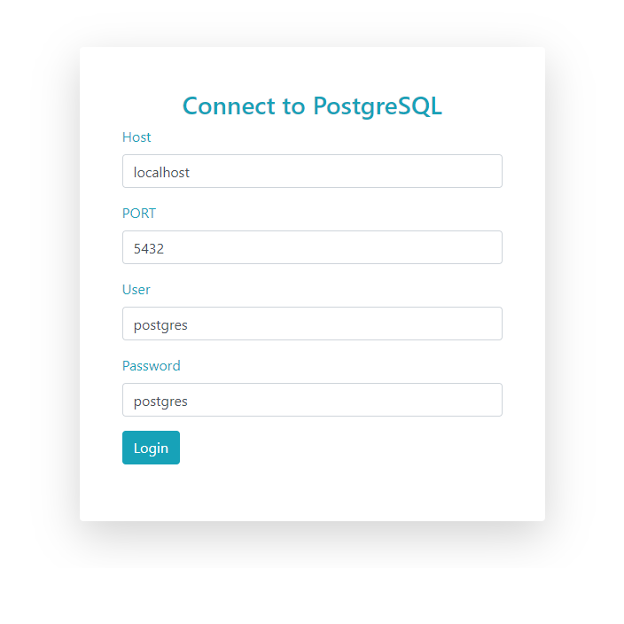

# SimplesAdminPG
Ferramenta simples para gerenciamento de banco postgrs. 


**Simple way:**
```php
use SimplesAdminPG\AdminPG;
include_once "SimplesAdminPG/AdminPG.php";

$conexao = new PDO( 'pgsql:host=localhost port=5432 dbname=ocorrencias user=postgres password=postgres');
AdminPG::main($conexao);
```

**Practical way:**
Run index.php in the src folder and use the form.



Nothing more to say. Just enjoy yourself!